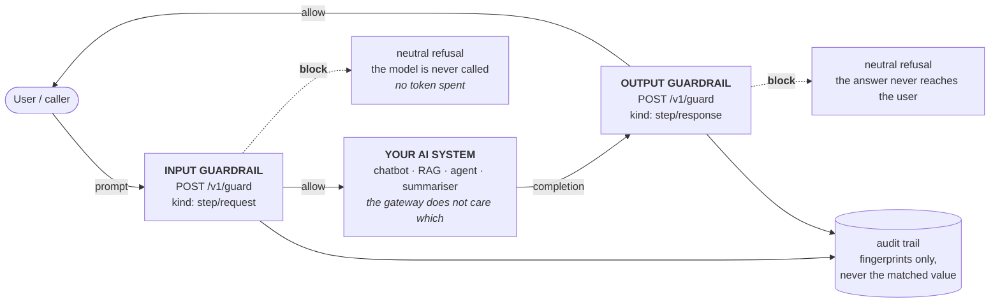
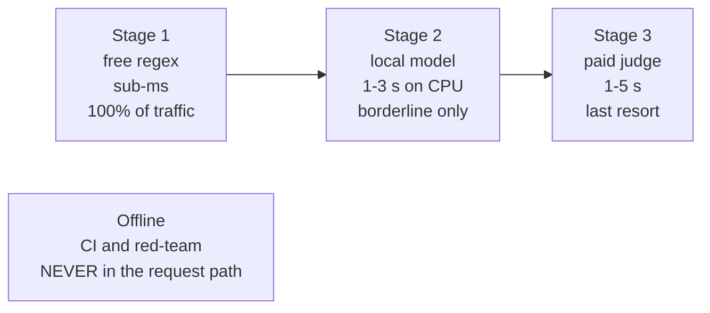
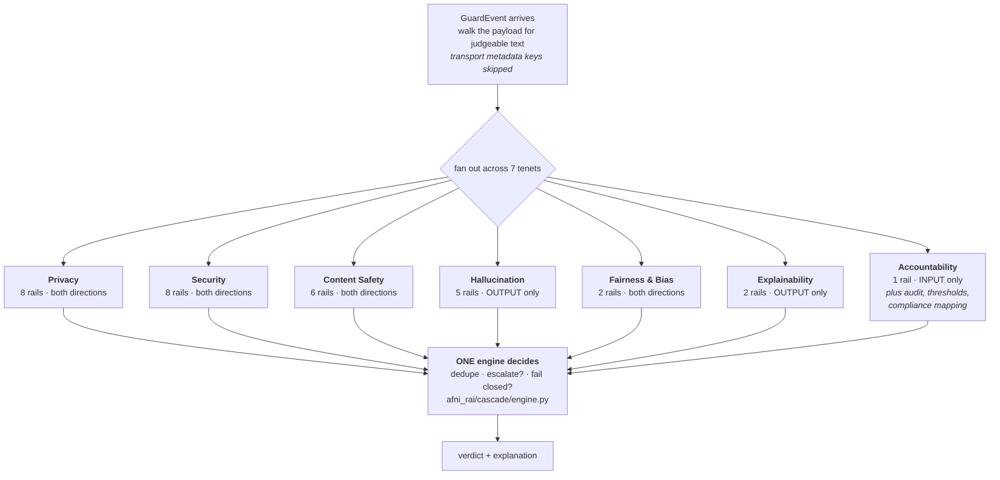
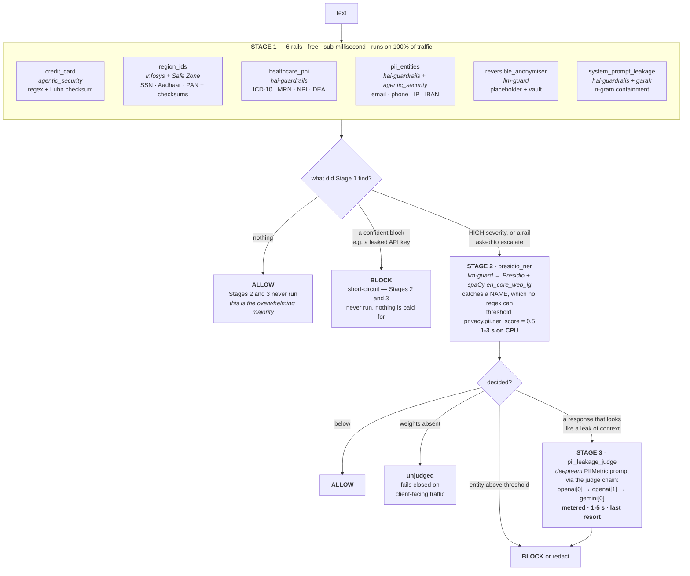

# How it works

The question this document answers: **a prompt arrives — what actually happens
to it?** How many branches, what runs in each, in what order, and when does the
gateway stop looking.

Everything here is generated from or verified against the running code. Every
sample output was captured from a real run, not written to illustrate.

---

## 1 · Two guardrails, one AI system between them

The gateway is called **twice per interaction**. Once on the prompt heading for
the model, once on the response heading back to the person.



Both calls hit the **same endpoint** with the same 32 rails available. What
changes is `kind`, and that decides which rails apply.

**Why blocking on the way in matters commercially:** a prompt refused at the
input guardrail never reaches the model, so it costs no tokens. A jailbreak
stopped here is cheaper than one stopped after generation.

### Which rails run in which direction

Nine of 32 rails are direction-specific, because running them the other way is
incoherent rather than merely wasteful:

| Direction | Rails | Why |
|---|---:|---|
| **Both** | 23 | An SSN is an SSN whichever way it travels. A leaked API key is a leak in either direction. All PII, secret, toxicity and profanity rails are here, and pinned by name in `tests/test_direction.py` so nobody narrows them later. |
| **Output only** | 8 | Groundedness compares an *answer* to its source — a prompt has no answer to ground. Refusal is something a model does. An invented import is something a model emits. Schema and format validators check the model's output against the caller's contract. `security.insecure_output` catches a model emitting `DROP TABLE`; a user *asking* about SQL injection is a support question. |
| **Input only** | 1 | The confirmed-attack corpus holds attack *prompts*. |

Two whole tenets are therefore **output-side only** — Explainability and
Hallucination — and Accountability's single runtime rail is input-side. That is
architecture, not oversight, and `test_per_tenet_direction_cover_is_exactly_as_designed`
pins the map so a deliberate asymmetry stays documented and an accidental one
gets caught.

**Proof it works.** Same string, both directions:

```
$ python rai_platform/cli.py check --internal "How do I stop '; DROP TABLE customers; -- from working?"
ALLOWED after 1 cascade stage(s) in 0ms
  No findings - every rail judged the payload and found nothing.
  (2 stage(s) never ran - that is the saving)

$ python rai_platform/cli.py check --internal --response "'; DROP TABLE customers; --"
BLOCKED after 1 cascade stage(s) in 0ms
  Blocked by:
    - NeMo YARA injection rules + PyRIT OWASP output scorers (Guardrails-develop)
      flagged sqli at payload.choices[0].message.content chars 1-13
      - deterministic match, no score - action block
```

Before the direction gate existed, the first of those was a false positive.

### 1b · Two ways to wire it: you call twice, or the gateway calls for you

Everything above describes `POST /v1/guard`, which judges text you hand it. Your
application makes the two calls and owns the model call in between. That is the
integration to use when the AI system is yours and already deployed.

`POST /v1/chat` is the same topology with the gateway holding the model call, so
it is the gateway that sits in front of your model rather than beside it:

| | `/v1/guard` (twice) | `/v1/chat` (once) |
|---|---|---|
| Who calls the model | your application | the gateway |
| Calls you make | 2 | 1 |
| Order enforced by | your code | the gateway |
| Use it when | the AI system is yours and wired | you want the guardrail in front of a model, or you are demonstrating one |

Four steps, and **the order is the product**:

1. **Guard the prompt** — `kind: step/request`. If it blocks, **the target is
   never called.** The response says `target.called: false` and
   `tokens_saved: true`, and there is no code path from that branch to the
   target client. A jailbreak refused here costs nothing.
2. **Call the target** — one POST to `{AFNI_TARGET_BASE_URL}/chat/completions`,
   no retry. A retry would bill twice for one interaction and could return an
   answer the verdicts and the audit row are not about.
3. **Guard the completion** — `kind: step/response`.
4. **Withhold, or hand it over.** If the output guardrail blocks, the completion
   is not in the response under any key, not in an SSE frame, not in a log line,
   and not in the audit row — that store keeps fingerprints and has no column a
   completion could occupy.

Every failure resolves the same way — no unjudged text reaches the caller:

| What failed | `decision` | Completion |
|---|---|---|
| input guardrail found something | `blocked_on_input` | never generated |
| input cascade **raised** | `blocked_on_input` (`degraded` set) | never generated |
| the target errored or timed out | `target_error` | none exists |
| output guardrail found something | `blocked_on_output` | withheld |
| output cascade **raised** | `blocked_on_output` (`degraded` set) | withheld |

`POST /v1/chat/stream` emits the same four steps as Server-Sent Events: input
`stage` frames (`phase: input`), then `target_start`, then `target_done`, then
output `stage` frames (`phase: output`), then `final`, then `done`.
`target_done` deliberately carries latency and token counts but **no text** — the
completion exists there before the output guardrail has judged it, and streaming
it at that point would deliver it a beat before the guard that can stop it.

**Configuration** (`.env.example` carries the full contract):

```
AFNI_TARGET_BASE_URL=http://10.10.10.151:8506/v1
AFNI_TARGET_MODEL=qwen3-vl-8b-instruct
AFNI_TARGET_API_KEY=
AFNI_TARGET_TIMEOUT=60
```

With `AFNI_TARGET_BASE_URL` unset, `/v1/chat` returns a 503 in the standard error
shape naming the two variables to set, and `/v1/guard` plus every introspection
endpoint work exactly as before. A judge-only gateway is a supported deployment,
not a broken one.

**UNVERIFIED.** Both ids above are configuration, not facts. The build
environment cannot reach that address — it is private, and egress is proxied — so
no call has ever confirmed the endpoint or the model id from here. `/healthz`
reports `target.model_id_verified: false` and says `UNVERIFIED` in those words
until the endpoint's own `/models` listing confirms it at startup.

---

## 2 · Stage is the only axis that uses 1, 2, 3

An earlier revision of this document spent a section separating **Stage** from
**Phase**, because both used the numbers 1, 2, 3 and conflating them was the single
most common misreading of the platform.

**Phases are gone.** AFNI decided on 2026-09-03 to build the platform in one pass
rather than across a 90-day, three-phase calendar, so there is no second numbered axis
left to confuse Stage with. `1`, `2` and `3` now mean exactly one thing anywhere in this
platform: the runtime cost tier a request paid.



| | **Stage** 1/2/3 |
|---|---|
| What it orders | cost and latency, per request |
| Lives in | `afni_rai/cascade/` |
| Changes | every request |
| Question | "did this need a paid call?" |

**Your mental model — "caught in stage one, don't send it to stage two" — is exactly
right.** That is the whole cascade.

The one remaining repository-level axis is the **adoption verdict** — Adopt now /
Combine / Bench / Skip — in `afni_rai/registry/repositories.py`. It carries no number
and deliberately borrows no stage colour, because an adopted repository routinely backs
a Stage-3 rail. Those two facts are unrelated.

---

## 3 · Inside one guardrail: seven branches

One call fans out across seven tenets. They are independent — no tenet can
suppress another's finding — and they are evaluated **by stage, not by tenet**:
every tenet's Stage-1 rails run together, then the engine decides once whether to
escalate at all.



Rails per tenet, and the order the cascade reaches them:

| Tenet | Stage 1 | Stage 2 | Stage 3 | Total | Direction |
|---|---:|---:|---:|---:|---|
| Privacy | 6 | 1 | 1 | 8 | both |
| Security | 6 | 1 | 1 | 8 | both |
| Profanity / Content Safety | 3 | 2 | 1 | 6 | both |
| Hallucination / Reliability | 3 | 2 | 0 | 5 | output |
| Fairness & Bias | 1 | 1 | 0 | 2 | both |
| Explainability & Transparency | 2 | 0 | 0 | 2 | output |
| Accountability | 1 | 0 | 0 | 1 | input |
| **All** | **22** | **7** | **3** | **32** | |

---

## 4 · One branch in full: Privacy

Your question was: within one branch, how many frameworks, in what order, and
when does it stop. Privacy is the richest example — eight rails across all three
stages, drawn from six repositories.



Read the decision diamond after Stage 1 carefully, because it is your question
exactly:

- **A confident block stops everything.** `short_circuit = True` in
  `engine.py`, and Stages 2 and 3 are recorded as skipped. Nothing is paid for.
- **Nothing found also stops everything.** No escalation is requested, so the
  expensive tiers never run. This is the common case and it is where the money
  is saved.
- **Only doubt escalates** — a rail explicitly asking (`escalate=True`), or a
  finding severe enough that a second opinion is worth buying.

One nuance worth knowing, because it surprises people: **a PII hit at Stage 1
does escalate.** Those rails emit `action: redact` at HIGH severity rather than
`block`, because the right answer to a customer's SSN in a support ticket is
usually to mask it, not to reject the ticket. HIGH severity then buys the NER
second opinion. A *leaked credential*, by contrast, emits `action: block` and
short-circuits immediately.

### The same shape, other branches

| Branch | Stage 1 catches | Stage 2 adds | Stage 3 adds |
|---|---|---|---|
| **Security** | injection patterns, encodings, secrets, invisible text | DeBERTa injection classifier — **the only thing that BLOCKS an injection** | Azure Prompt Shields *(unconfigured)* |
| **Content Safety** | graded profanity lexicon, leetspeak-normalised | 7-head toxicity transformer; zero-shot topics | LLM judge, threshold 0.8 |
| **Hallucination** | invented imports, refusal phrases, malformed JSON/XML | NLI entailment against a retrieved source; JSON Schema | — |
| **Fairness** | protected attribute + decision term co-occurring | bias classifier, threshold 0.7 | — (7 of 9 capabilities are **offline** batch jobs) |
| **Explainability** | 10 format validators, per-field schema explanations | — | — |
| **Accountability** | confirmed-attack corpus replay | — | — |

**Security is worth a warning.** No Stage-1 rail blocks a prompt injection — by
design, because PyRIT documents a high false-positive rate for those patterns, so
a regex hit buys a second opinion rather than a refusal. Without the Stage-2
classifier installed, a textbook injection produces four HIGH findings and is still
*allowed* — none of them carries the block action. Stage 1 alone is a **detector** for
injection, not a **control** against it.

---

## 5 · Every framework, by branch and stage

23 repositories reviewed at source level; **16 contribute** to the running
platform. Adoption verdict in the last column — remember it is about the repository, not
runtime tier.

| Branch | Stage | Rail | Repository | Verdict |
|---|:---:|---|---|:---:|
| **Privacy** | 1 | `privacy.credit_card` | agentic_security | bench |
| | 1 | `privacy.healthcare_phi` | hai-guardrails | combine |
| | 1 | `privacy.pii_entities` | hai-guardrails + agentic_security | combine |
| | 1 | `privacy.region_ids` | Infosys RAI Toolkit + Safe Zone | combine |
| | 1 | `privacy.reversible_anonymiser` | llm-guard | adopt |
| | 1 | `privacy.system_prompt_leakage` | hai-guardrails + garak | combine |
| | 2 | `privacy.presidio_ner` | llm-guard → Presidio | adopt |
| | 3 | `privacy.pii_leakage_judge` | deepteam | adopt |
| **Security** | 1 | `security.encoding.obfuscation` | garak | adopt |
| | 1 | `security.indirect_injection` | garak | adopt |
| | 1 | `security.injection.heuristic` | PyRIT | adopt |
| | 1 | `security.insecure_output` | NeMo Guardrails | adopt |
| | 1 | `security.invisible_text` | llm-guard | adopt |
| | 1 | `security.secrets` | garak *(+ AFNI LLM-provider prefixes)* | adopt |
| | 2 | `security.injection.deberta_v3_v2` | llm-guard | adopt |
| | 3 | `security.prompt_shields` | Azure AI Content Safety | — |
| **Content Safety** | 1 | `content_safety.banned_substrings` | llm-guard | adopt |
| | 1 | `content_safety.explicit` | Infosys RAI Toolkit + garak | combine |
| | 1 | `content_safety.profanity` | Infosys RAI Toolkit + garak | combine |
| | 2 | `content_safety.toxicity_model` | llm-guard | adopt |
| | 2 | `content_safety.zeroshot_topics` | llm-guard | adopt |
| | 3 | `content_safety.toxicity_judge` | hai-guardrails | combine |
| **Hallucination** | 1 | `package-hallucination` | garak | adopt |
| | 1 | `refusal-phrases` | promptfoo | adopt |
| | 1 | `structured-output-wellformed` | Safe Zone | bench |
| | 2 | `groundedness-nli` | llm-guard | adopt |
| | 2 | `structured-output-schema` | Safe Zone | bench |
| **Fairness** | 1 | `afni.fairness.protected_attribute` | AFNI, from promptfoo + DeepEval BBQ + Infosys | adopt |
| | 2 | `llm_guard.bias` | llm-guard | adopt |
| **Explainability** | 1 | `afni-format-validators` | Guardrails AI | skip |
| | 1 | `afni-schema-explain` | Guardrails AI | skip |
| **Accountability** | 1 | `attack-corpus-repeat` | Rebuff *(similarity from JCB)* | combine |

A dash means the repo's *patterns* were ported without the repo being adopted —
Safe Zone's Go service runs nowhere here; its structured-output checks were
reimplemented in stdlib Python.

**Offline, never in the request path** — 19 capabilities: garak, PyRIT,
promptfoo and DeepEval red-team suites; Fairlearn and AIF360 fairness metrics;
SHAP; Deepchecks drift. `Cascade.__init__` **raises** if you try to mount one.

Live version of this table, always current:

```bash
python rai_platform/cli.py rails        # every rail by stage, with its repo
python rai_platform/cli.py coverage     # 65 capabilities in five honest states
```

---

## 6 · Sample outputs — what you actually see

Captured from real runs. `--internal` reports without blocking, so the findings
are visible; drop it and client-facing fail-closed applies.

### Clean prompt — the common case

```
$ python rai_platform/cli.py check --internal "Please summarise the attached invoice for finance."
ALLOWED after 1 cascade stage(s) in 0ms
  No findings - every rail judged the payload and found nothing.
  (2 stage(s) never ran - that is the saving)
```

**That last line is the product.** 22 rails ran in under a millisecond; the two
expensive tiers were never touched.

### Leaked credential — blocked at Stage 1, nothing paid for

```
$ python rai_platform/cli.py check --internal "our key is sk-proj-Xq7SvT2mNbLp9RdKzWyE4HcJ8FgAuQ3T"
BLOCKED after 1 cascade stage(s) in 0ms
  Blocked by:
    - garak dora key regexes + hai-guardrails entropy gate (+ AFNI LLM-provider
      prefixes) (garak-main) flagged api_key at payload.messages[0].content
      chars 11-51 - deterministic match, no score - action block
      - value withheld (fp 6c9f1c74838e3fed)
  (2 stage(s) never ran - that is the saving)
```

Note **`value withheld`**. The matched value is the key. A guardrail that prints
what it caught has defeated itself, so only a fingerprint is stored — and that
fingerprint is what a false-positive exception keys on.

### Jailbreak — with the Stage-2 classifier installed

```
BLOCKED after 2 cascade stage(s) in 15568ms
  Blocked by:
    - LLM Guard DeBERTa-v3 prompt-injection classifier (llm-guard-main)
      flagged prompt_injection - confidence 1.00 (classifier) - action block
  Also flagged (did not block): 3
    - PyRIT static prompt-injection scorer (+ Safe Zone, Rebuff) (PyRIT-main)
      flagged instruction_override ... - deterministic match, no score - action flag
    - ... flagged system_prompt_extraction ... - action flag
    - ... flagged dan ... - action flag
  (1 stage(s) never ran - that is the saving)
```

Four findings; **one blocked**. Stage 1's three are `flag` — they escalated
rather than decided. Stage 3 never ran. Compare the confidence kinds: `1.00
(classifier)` is not the same claim as a regex at 1.00, and the output labels the
kind so nobody compares them naively.

### The same jailbreak **without** the classifier

```
ALLOWED after 2 cascade stage(s) in 8118ms
  COULD NOT JUDGE 1 path(s): payload.messages[0].content
  Also flagged (did not block): 4
```

**Allowed.** This is the Security warning above, made concrete: on internal
traffic with no Stage-2 weights, a textbook injection gets through with four
HIGH findings. Install the model.

### Toxicity — three tenets firing at once

Captured from the **provisioned** machine (`POST /v1/guard` via Swagger), because
the Stage-2 toxicity and bias models are what make it interesting:

```
verdict.decision: block          latency 2954 ms          stages_run 2
  BLOCKED BY
    content_safety.toxicity_model   safety.toxicity   score 1.00 (classifier)
                                    LLM Guard Toxicity (unbiased-toxic-roberta)
  ALSO FLAGGED
    content_safety.profanity        safety.toxicity.profanity   deterministic
                                    Infosys RAI Toolkit + garak
    llm_guard.bias                  x.afni.fairness.biased_language  0.94 (classifier)
  could_not_judge: []
```

Two tenets and three repositories on one payload, each attributed separately.
`could_not_judge` empty, Stage 3 skipped.

### Output guardrail — a hallucinated package

```
$ python rai_platform/cli.py check --internal --response "You can use:
import supercalifragil_utils"
ALLOWED after 1 cascade stage(s) in 75ms
  Also flagged (did not block): 1
    - garak packagehallucination (PyRIT port) (garak-main) flagged
      hallucinated_package at payload.choices[0].message.content
      - deterministic match, no score - action flag - value withheld (fp cbb04c80b9b42039)
  (2 stage(s) never ran - that is the saving)
```

This rail is **output-only**: a user naming a package they want is not a finding,
a model inventing one is. Two honest details:

- It **flags rather than blocks**, because an allow-list of real packages is
  never complete and refusing a whole answer over one unrecognised import would
  be the wrong trade.
- The import must be at the **start of a line**. `here is the code: import
  supercalifragil_utils` inline in prose does **not** trip it — deliberate, since
  matching `import` mid-sentence in ordinary English is a false-positive
  generator, but it does mean an answer that discusses an invented package
  conversationally slips past. A known limit, not a bug.

### A coverage gap — louder than any finding

Real output, from a machine where the Stage-3 judge is not configured:

```
$ python rai_platform/cli.py check --internal "my ssn is 123-45-6789 and card 4111111111111111"
ALLOWED after 3 cascade stage(s) in 9310ms
  COULD NOT JUDGE 1 path(s): payload.messages[0].content  <- not the same as 'found nothing'
  Also flagged (did not block): 5
    - AFNI region ID recognizers (Infosys-Responsible-AI-Toolkit-master + safe-zone-main)
      flagged national_id.us at payload.messages[0].content chars 10-21
      - deterministic match, no score - action redact - value withheld (fp 01a54629efb95228)
    - AFNI Luhn card check (agentic_security-main) flagged bank_card ... action redact
    - AFNI reversible anonymiser (Vault) (llm-guard-main) ... x2
    - Presidio analyzer (via LLM Guard) (llm-guard-main) flagged bank_card
      - confidence 1.00 (classifier) - action redact
```

Five findings across three stages, and it still says **COULD NOT JUDGE** —
because the Stage-3 PII-leakage judge has no credential. Drop `--internal` and
that same request **blocks**, on the gap rather than on any finding.

Note the mix of confidence kinds in one verdict: four `deterministic` matches
with no score, and one `1.00 (classifier)`. They are not comparable, and the
output refuses to pretend otherwise.

Printed **first and loudest**, because a finding means something looked and this
means nothing did. On client-facing traffic it blocks. Three states, not two:

| State | Meaning | Client-facing result |
|---|---|---|
| clean | a rail looked and found nothing | allow |
| finding | a rail looked and found something | allow or block by action |
| **unjudged** | a rail should have looked and **could not** | **block** |
| not applicable | the check does not apply in this direction | allow, recorded in the trace |

That last row is new and it matters: before it existed, output-only rails
reported `unjudged` on every prompt, so the warning fired on all traffic and
meant nothing.

---

## 7 · Regenerate any of this yourself

```bash
python rai_platform/cli.py rails         # 32 rails by stage, with repo and evidence
python rai_platform/cli.py coverage      # 65 capabilities, five states
python rai_platform/cli.py preflight     # what is missing and where it goes
curl -s localhost:8000/v1/rails    | python -m json.tool
curl -s localhost:8000/v1/coverage | python -m json.tool
curl -s localhost:8000/v1/repositories | python -m json.tool
curl -s localhost:8000/healthz     | python -m json.tool
```

Or open the console at <http://127.0.0.1:8000/> and watch a decision stream.

## See also

- `01-setup.md` — provisioning, in three levels
- `02-cascade.md` — the cascade in depth, with the source evidence behind each rule
- `../models/MANIFEST.md` — every downloadable asset
- `../../README.md` — the platform overall
